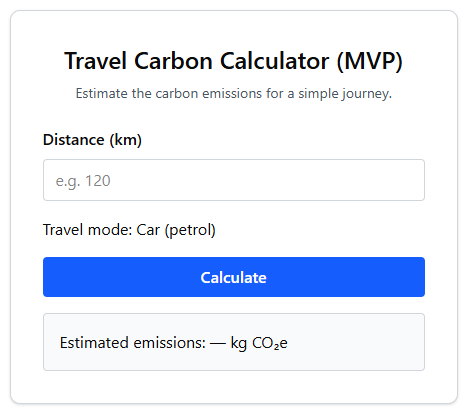

## Initial Design (MVP)

The initial version of the Travel Carbon Calculator was designed as a very small
Minimum Viable Product (MVP).

The first iteration focuses on a single use case:
- Estimating carbon emissions for a car (petrol) journey
- Distance input only (kilometres)
- Single output showing estimated CO₂e emissions

This deliberately limited scope allowed the core calculation logic and user flow
to be validated before expanding to additional travel modes and features.

