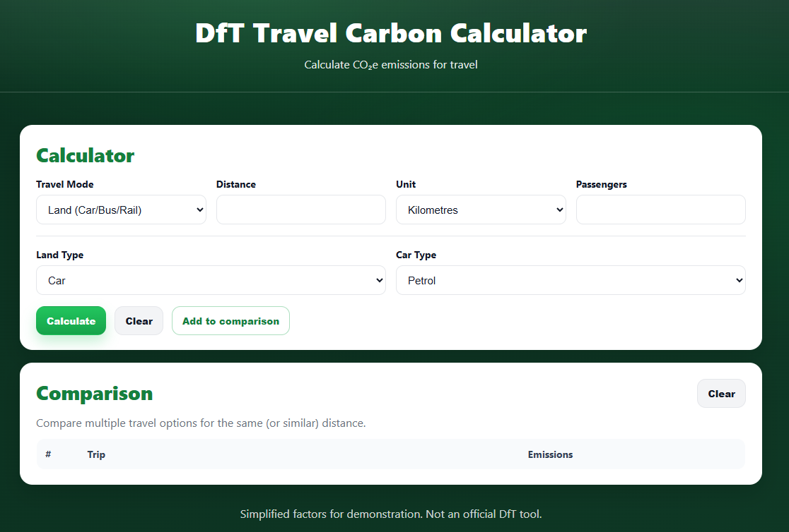
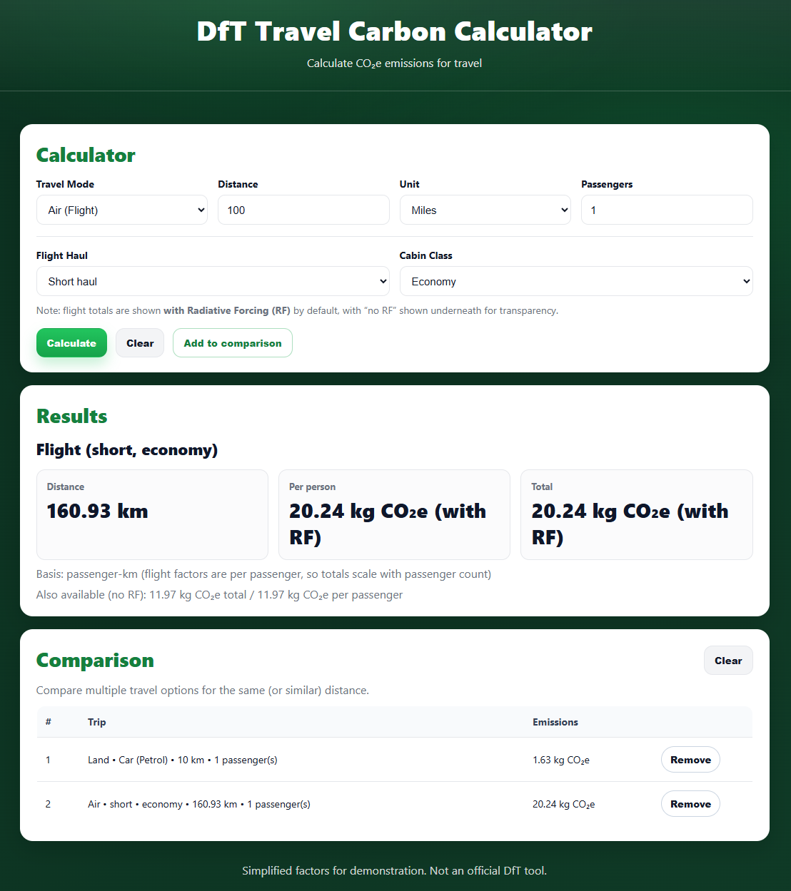
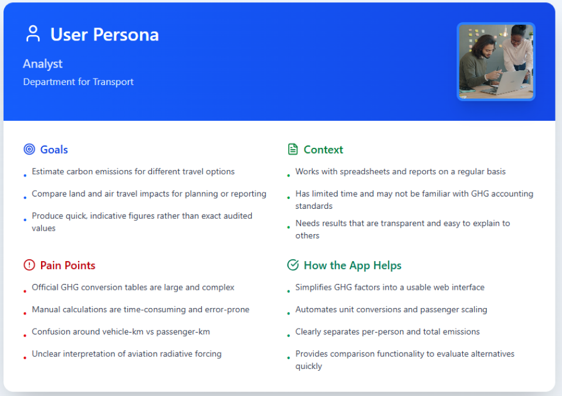
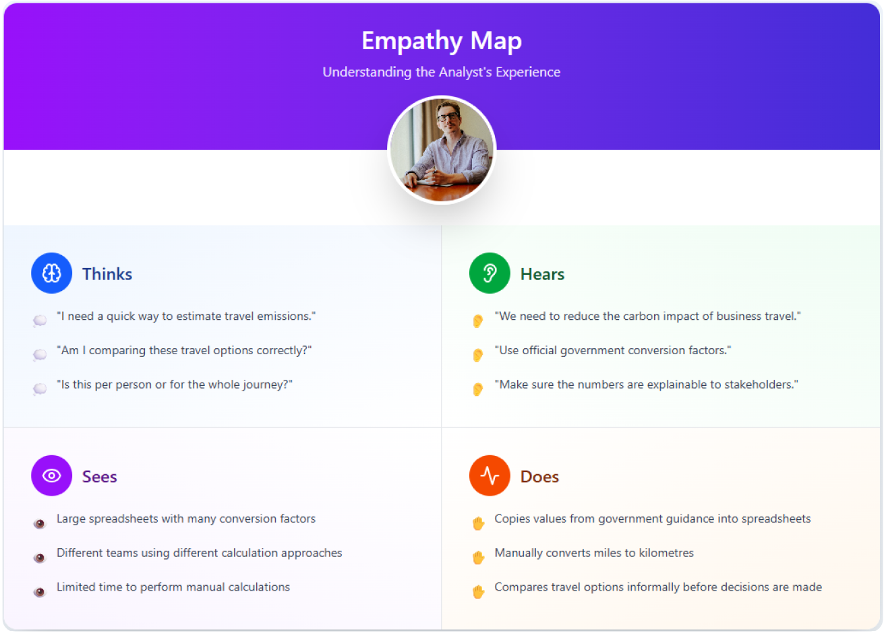
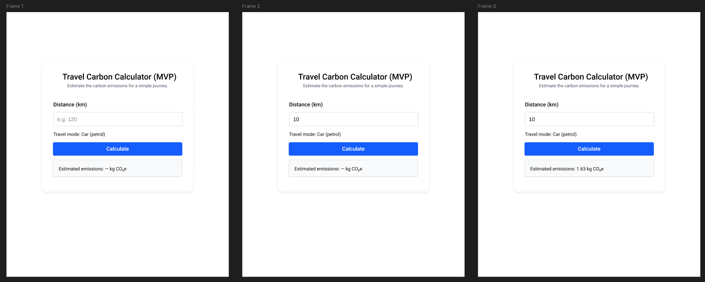
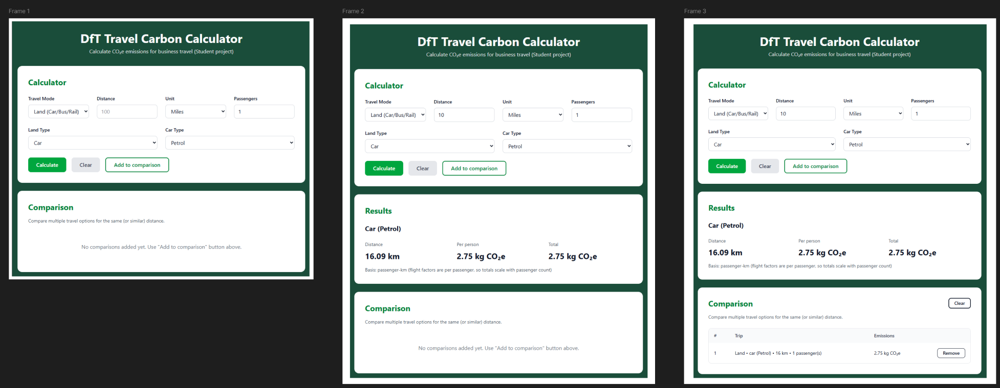
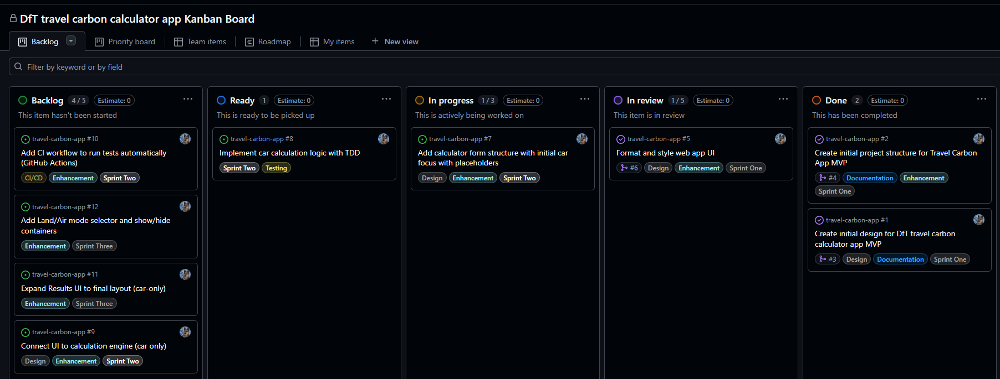

# DfT Travel Carbon Calculator ✈️🚗🚄

README for Summative One: DfT Travel Carbon Calculator Web App.

**Live Application:** [https://dhi-verma.github.io/travel-carbon-app/](https://dhi-verma.github.io/travel-carbon-app/)

**Figma Design:** Navigate to [Figma Design](https://www.figma.com/design/HC0veTiBJUiM2WAavs45Eg/carbon-web-app-figma-design?m=auto&t=M49Esx0awY1pOrvq-1)

[](https://github.com/dhi-verma/travel-carbon-app/actions)
[](LICENSE)

<details closed><summary>Introduction and Overview</summary>

## Introduction to DfT Travel Carbon Calculator



***Figure One**: Screenshot of the fully deployed Travel Carbon Calculator showing the calculator inputs, results section, and comparison table.*

In Department for Transport, there is focus on reducing the environmental impact of day-to-day operations. One contributor to organisational carbon emissions is business travel. This includes land-based journeys and air travel.

The Government publishes official greenhouse gas (GHG) conversion factors. These are used to estimate carbon emissions. However, applying them correctly can be difficult for non-technical users. It can be time-consuming when users need to compare different travel options quickly. In many cases, these calculations are performed frequently using spreadsheets or external tools.

Another challenge is that different transport modes use different measurement bases. Some factors are measured per vehicle-kilometre. Others are measured per passenger-kilometre. This can lead to confusion or incorrect estimates. Aviation emissions can also include adjustments such as Radiative Forcing (RF). This makes interpretation harder for users who are unfamiliar with environmental reporting standards.

This project aims to address these issues by providing a simple solution. The DfT Travel Carbon Calculator is a web application that estimates carbon dioxide equivalent emissions (kgCO₂e) for land and air travel. Calculations are based on distance, transport type and number of passengers. The application displays both per-person and total journey emissions. Clear explanations are provided so users understand how results are produced.

The main users of this application include analysts, policy teams, and operational staff in DfT. These users often need to make quick, indicative comparisons between different travel options as part of planning, reporting, or decision-making activities. The app provides a simple way to estimate emissions without relying on complex spreadsheets or specialist software.

</details>

<details closed>
<summary>User Documentation</summary>

## User Documentation

The DfT Travel Carbon Calculator is a browser-based tool designed to provide **indicative estimates of carbon emissions (kgCO₂e)** for common business travel scenarios. Users enter journey details and receive both **per-person** and **total** emissions, alongside a short explanation of the calculation basis used.

### Features

The app contains the following features:

* Input distance in kilometres or miles for any journey
* Select from multiple land transport modes: car (petrol, diesel, electric, hybrid, plug-in hybrid), bus (local, coach, London), rail (national, metro, international), or taxi
* Calculate air travel emissions for short, medium, or long-haul flights across economy, premium economy, business, or first class
* View per-person and total group emissions with clear explanation of calculation basis (vehicle-km vs passenger-km)
* Understand radiative forcing (RF) impact for flights, with both with-RF and without-RF values displayed
* Compare multiple travel options side-by-side in a comparison table
* Add and remove trips from comparison to evaluate different journey scenarios
* Input validation with clear error messages for invalid entries

### How to Use the App

1. Select a **Travel Mode** (Land or Air).
2. Enter the **Distance** and choose the unit (kilometres or miles).
3. Enter the **Number of Passengers**.
4. Select the relevant transport option:
   - **Land**: Choose a land type (Car / Bus / Rail / Taxi), then select the specific option.
   - **Air**: Choose flight haul (Short / Medium / Long) and cabin class.
5. Click **Calculate** to display the results.
6. (Optional) Click **Add to comparison** to store the result for side-by-side comparison.



***Figure Two**: Deployed Travel Carbon Calculator interface showing inputs and calculated outputs.*

> **Note:**  
> Flight emissions are displayed **with Radiative Forcing (RF)** by default to reflect full climate impact. A **without-RF** value is also shown for transparency.

</details>

<details closed>
<summary>Technical Documentation</summary>

## Technical Documentation

The Travel Carbon Calculator is a static web application requiring no server setup. Node.js and npm are only needed for running the test suite.

### Local Setup

**Check prerequisites:**
```sh
node -v
npm -v
```

If Node.js is not installed, download from [nodejs.org](https://nodejs.org/).

**Clone and install:**
```sh
git clone https://github.com/dhi-verma/travel-carbon-app.git
cd travel-carbon-app
npm install
```

### Running Tests

**Execute test suite:**
```sh
npm test
```

**Generate coverage report:**
```sh
npm test -- --coverage --watchAll=false
```

The test suite validates emission calculations, unit conversions, passenger scaling, and input validation across numerous test cases.

### Running the Application

The calculator runs directly in any browser. Open `index.html`.

For development with a local server:
```sh
python -m http.server 8000
```

Access at `http://localhost:8000`.

## Technical Stack

**Stack:**
* HTML, CSS, JavaScript

**Testing & CI:**
* Jest for unit testing
* [GitHub Actions](https://github.com/dhi-verma/travel-carbon-app/actions) for automated test runs

**Tools:**
* [GitHub Projects](https://github.com/users/dhi-verma/projects/2) for Kanban workflow
* [Figma](https://www.figma.com/design/HC0veTiBJUiM2WAavs45Eg/carbon-web-app-figma-design?m=auto&t=M49Esx0awY1pOrvq-1) for design prototyping

**Application Files:**
* `index.html`
* `script.js`
* `src/calc.js`
* `styles.css`

**Testing Files:**
* `tests/calc.test.js` 
* `package.json` 

**Data:**
* UK Government GHG Conversion Factors (2025) embedded in `src/calc.js`

</details>

<details closed>
<summary>Design</summary>

## Design and [Figma](https://www.figma.com/design/HC0veTiBJUiM2WAavs45Eg/carbon-web-app-figma-design?m=auto&t=M49Esx0awY1pOrvq-1) Prototyping

### User Persona

User personas were developed to understand the target users and their needs when calculating travel emissions.



***Figure Three**: User persona for a sustainability analyst at the Department for Transport, highlighting goals, context, pain points, and how the app addresses their needs.*

The primary user is an analyst at DfT who regularly produces reporting or planning outputs involving travel emissions. They often work with spreadsheets and policy documents and need quick, indicative estimates for comparison. While they understand the sustainability context, they may not be confident applying GHG conversion factors correctly, so outputs must be transparent and explainable.

### Empathy Map

An empathy map was developed to understand the user's experience and workflow challenges when working with travel emission calculations.



***Figure Four**: Empathy map based on the user persona, showing what the analyst thinks, hears, sees, and does in their role.*

The empathy map highlights that users need fast estimates and work under time pressure. They often rely on large conversion-factor spreadsheets. This app should reduce manual steps (unit conversion, factor selection, passenger scaling) and present clear results.

### Initial Wireframe Design


***Figure Five**: Initial MVP wireframe focusing on the core calculator concept with car emissions only.*

The initial wireframe validated the core flow with minimal features:
- one distance input (km)
- one travel option (car – petrol)
- simple output display

### Design Exploration



***Figure Six**: Three frames exploring different layout approaches for the MVP calculator interface.*

Multiple layout options were explored in the initial design phase. The single-column card-based layout was selected for its clarity and mobile-friendly responsive behavior.

### Final Design



***Figure Seven**: Final design showing the complete calculator with various transport mode selection and comparison functionality.*

The final design evolved significantly from the MVP, adding:

- **Travel mode selector** to separate Land and Air journeys
- **Conditional inputs** so users only see the relevant options (land type vs flight haul/class)
- **Structured results grid** showing distance, per-person emissions, and total emissions clearly
- **Comparison table** to support side-by-side evaluation of travel choices
- **Green visual theme** to reflect sustainability focus (without using official DfT branding)

Responsive layout and clear messaging (errors/warnings) were prioritised to keep the interface usable for non-technical users.

</details>

<details closed>
<summary>Project Management</summary>

## Project Management Structure



***Figure Eight**: The Project Kanban board on [GitHub Projects](https://github.com/users/dhi-verma/projects/2). This allows tickets (issues) to be tracked.*

This project was managed using an Agile, sprint-based workflow. Work was broken into small deliverables (features, enhancements, testing, and documentation) and tracked as GitHub issues on a Kanban board. This made progress visible and ensured each change could be planned, implemented, reviewed, and merged in a controlled way.

I worked in sprints that each had a set of objectives and tickets to accomplish before reviewing progress and planning the next sprint. During development, I kept my tickets (issues) within the project Kanban board, shown in Figure Eight. This allowed me to break the project development into chunks that could be assigned specific labels, branches, and pull requests. The board has five sections: Backlog, Ready, In Progress, In Review, and Done.

Each branch that I created followed the naming convention of `feature/` or `docs/` followed by the issue description. When changes occurred within the scope, they were added to the sprint and prioritised accordingly. If I was working in a team environment, I would ensure that Scrum meetings were incorporated throughout the sprints to gauge progress and address blockers.

### Sprint Overview

Development progressed through three sprints:

**Sprint One** focused on establishing the foundation with design and basic project setup. This sprint delivered the initial wireframe, project structure, foundational CSS styling, and the calculator form scaffold.

**Sprint Two** centered on implementing core functionality using test-driven development. This sprint produced the calculation engine with tests, connected the UI to make the calculator functional and added the CI/CD pipeline with GitHub Actions.

**Sprint Three** expanded the application to its full feature set including results UI enhancements, land/air mode selection, and completion of all transport modes with the comparison table.

After each sprint, I conducted a review to assess what went well and what could be improved, allowing refinements for the next sprint. This iterative reflection helped maintain quality and adapt to emerging requirements.

### Workflow and Conventions

**One issue → one branch → one pull request** 
This workflow was followed throughout the project to maintain traceability between requirements, implementation, and code review. Each pull request was linked to its corresponding issue and merging the PR automatically closed the issue. I kept the Kanban board synchronised with the repository state.

Labels were applied to categorise work by type (Design, Enhancement, Testing, CI/CD, Documentation) and by sprint (Sprint One, Sprint Two, Sprint Three), enabling efficient filtering and sprint planning.

</details>
